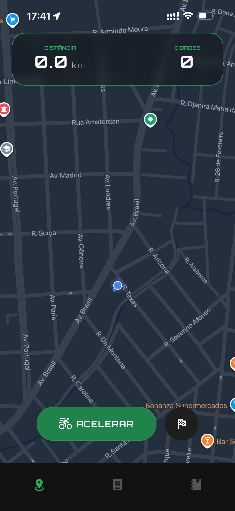
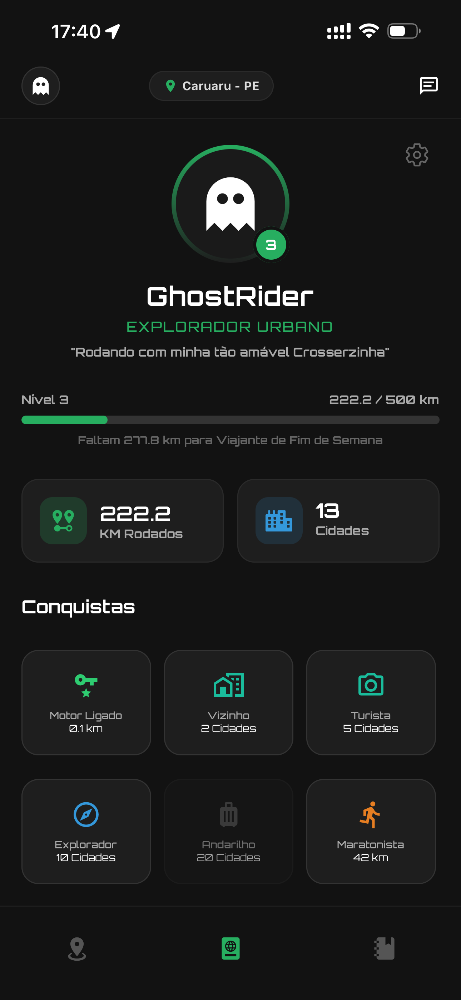
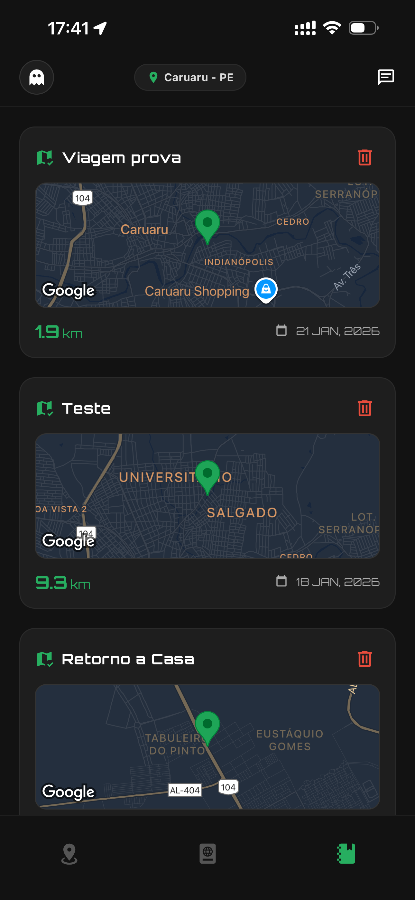

# 🏍️ MotoWave


<br/>

<div align="center">
  
</div>

<br/>

O **MotoWave** não é apenas um GPS. É um diário de bordo inteligente projetado especificamente para motociclistas que desejam registrar suas expedições, monitorar sua evolução na estrada e "conquistar" o mapa.

---

## 💡 O Conceito

Aplicativos de navegação comuns (Waze, Google Maps) focam em te levar do ponto A ao ponto B o mais rápido possível. Eles "esquecem" o trajeto assim que você chega.

Para um motociclista, **o trajeto é o destino**.

O MotoWave nasceu para preencher essa lacuna: um app que funciona em segundo plano, rastreia cada curva, detecta automaticamente cidades novas visitadas (mesmo sem internet) e gamifica a experiência de pilotagem através de um sistema de níveis e conquistas.

---

## 🚀 Problemas Resolvidos & Diferenciais

### 1. Arquitetura "Offline-First"
Muitas das melhores estradas não têm sinal de celular. O MotoWave utiliza **AsyncStorage** para persistir dados localmente a cada movimento.
* **Solução:** Você pode rodar 500km sem internet. Assim que a conexão voltar, o app sincroniza tudo com a nuvem (Supabase) sem perder um único metro.

### 2. Otimização de Consumo de API
Reverse Geocoding (transformar latitude/longitude em "Nome da Cidade") é caro e limitado.
* **Solução:** Implementamos um algoritmo inteligente que desenha a rota a cada **50 metros** (para precisão visual), mas só verifica a cidade na API a cada **3 km**. Isso evita bloqueios (*Rate Limiting*) e economiza bateria.

### 3. Inteligência Espacial (PostGIS)
Não salvamos apenas números. Salvamos geometria.
* **Solução:** Integração com **PostgreSQL + PostGIS** no Supabase. As rotas são salvas como `LINESTRING` e as cidades como `POINT`. Isso permite consultas espaciais complexas e renderização performática no mapa.

### 4. Gamificação Automática (Triggers)
* **Solução:** O app não calcula níveis no front-end para não pesar. Usamos **Database Triggers** no SQL que atualizam automaticamente o `total_km` e o nível do usuário assim que uma viagem é salva.

---

## 📱 Funcionalidades Principais

* **Rastreamento em Tempo Real:** Desenho de rota (Polyline) no mapa com estilo Dark Mode customizado.
* **HUD (Heads-Up Display):** Painel com efeito *Glassmorphism* (Vidro/Blur) e Neon para visualização rápida de KM e Cidades.
* **Diário de Bordo (Histórico):** Lista de viagens com miniaturas de mapas geradas dinamicamente e otimizadas (`liteMode`).
* **Detalhes da Viagem:** "Replay" da aventura, mostrando a rota exata e o roteiro de cidades passo a passo.
* **Passaporte do Viajante:** Perfil gamificado. Comece na "Garagem" e suba de nível até virar uma "Lenda do Asfalto" baseada na sua quilometragem.
* **Gestão de Sessão:** Login/Cadastro seguros, recuperação de sessão e tratamento silencioso de *Refresh Token*.

---

## 📸 Galeria

<div align="center">
  <table>
    <tr>
      <td align="center"><b>Home (Blur HUD)</b></td>
      <td align="center"><b>Passaporte Dark</b></td>
      <td align="center"><b>Histórico & Rotas</b></td>
    </tr>
    <tr>
      <td>
        
      </td>
      <td>
        
      </td>
      <td>
        
      </td>
    </tr>
  </table>
</div>

---

## 🛠️ Stack Tecnológica

* **Mobile:** React Native (Expo SDK 50+).
* **Linguagem:** TypeScript.
* **Banco de Dados:** Supabase (PostgreSQL).
* **Mapas:** `react-native-maps` (Google Provider) com estilização JSON customizada.
* **Estilização:** `StyleSheet` nativo para performance máxima + `expo-blur` e `expo-linear-gradient` para UI Premium.
* **Localização:** `expo-location` (Foreground Service).

---

## 🔮 Roadmap (Futuras Features)

O desenvolvimento do MotoWave é contínuo. As próximas atualizações incluirão:

- [ ] **Feed de Eventos:** Descubra encontros de motociclistas próximos à sua localização.
- [ ] **Social:** Compartilhe fotos atreladas aos eventos e viagens no Feed.
- [ ] **Configurações:** Personalização de tema e unidades de medida.
- [ ] **Badges Especiais:** Conquistas como "Iron Butt" (1000km em 24h) ou "Explorador de Estados".

---

## 💻 Rodando o Projeto Localmente

Siga os passos abaixo para ter o MotoWave rodando na sua máquina.

### Pré-requisitos
* Node.js instalado.
* Gerenciador de pacotes (NPM ou Yarn).
* Conta no [Supabase](https://supabase.com) (para o backend).
* Emulador Android/iOS ou dispositivo físico com o app **Expo Go**.

### 1. Clonar o repositório
```bash
git clone https://github.com/luanrf5g/motowave-mobile.git
cd motowave-mobile
```

### 2. Instalar as dependências
```bash
  npm install
```
### 3. Configurar Variáveis de Ambiente
Crie um arquivo `.env` na pasta raiz do projeto e adicione a Url e a chave para o projeto com as tabelas no supabase seguindo o exemplo do arquivo `.env.example`

### 4. Rode o projeto
Para rodar o projeto de maneira a você conseguir utilizar o app mesmo com uma rede diferente à do pc base, utilize a flag `--tunnel` no terminal

```bash
  npx expo start
  # ou
  npx expo start --tunnel
```
  * Pressione `o` para abrir no Emulador do Android.
  * Pressione `i` para abrir no Emulador do Iphone.
  * Ou escaneie o QR Code com o app ExpoGo no seu celular.

---

<div align="center">
  Desenvolvido com 💜 e gasolina por <b><u>Luan</u></b>
</div>
